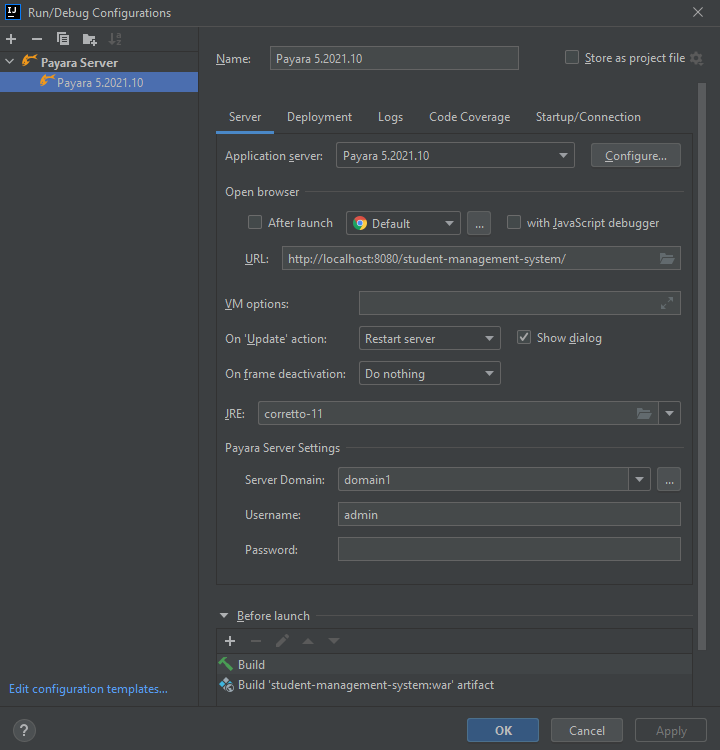

# Java EE / JAX RS Project

A student management system using a Docker-container and Payara Server configuration.

## Getting Started

### Deployment

1. Download [Payara.](https://www.payara.fish/downloads)
2. Clone this [repository](https://github.com/ErikssonF/student-management-system-1)
by following [this article.](https://docs.github.com/en/repositories/creating-and-managing-repositories/cloning-a-repository)
3. Install Payara Platform Tools Plugin.
4. Configure a local Payara Server as shown in photo below: <br/>

5. Download [Docker.](https://www.docker.com/products/docker-desktop)
6. Run the command below in CMD and run the container in Docker: <br/>
docker run --name mysql -e MYSQL_ROOT_PASSWORD=my_secret_password -e
   'MYSQL_ROOT_HOST=%' -e MYSQL_DATABASE=test -e MYSQL_USER=user -e
   MYSQL_PASSWORD=password -p 3306:3306 mysql:latest
7. After following these steps you should be able to run the application.

### Running program

Download [Insomnia.](https://insomnia.rest/download)

There are 5 different requests that the application can handle: **Create**, **Delete**, **Get all**, **Get all(By lastName)** and **Update.**

Use **http://localhost:8080/student-management-system/<endpoint>** to access each request.

To create a student, use the following URL: **http://localhost:8080/student-management-system/students**
<br/>
Configure this in Insomnia as a POST-request and add the following code with JSON-formatting.<br/>
```
{
"firstName": "Fredrik", 
"lastName": "Eriksson",
"email": "test@test.com",
"phoneNumber": 0123456789
}
```
The same goes for updating a student. Use the following endpoint and access the student by its id: **/students/{id}**
```
{
	"firstName": "Fredrik",
	"lastName": "Eriksson",
	"id": 1,
	"email": "test@test.com",
	"phoneNumber": 1234
}
```

To create a teacher, use /teachers: 

```
{
	"firstName": "Fredrik",
	"lastName": "Eriksson",
	"age": "21"
}
```

To create a subject with added students and a teacher, use /subjects:

To update a subject, add "id" above "subjectname", as well as the id in the URL: **/subjects/{id}**.

```
{
	"subjectName": "Math",
	"student": [
		{
			"email": "Student@test.se",
			"firstName": "firstName",
			"id": 1,
			"lastName": "lastName",
			"phoneNumber": "123456789"
		},
		{
			"email": "student@test.se",
			"firstName": "firstName",
			"id": 2,
			"lastName": "lastName",
			"phoneNumber": "123456789"
		}
	],
	"teacher": {
		"email": "teacher@email.se",
		"firstName": "firstName",
		"id": 6,
		"lastName": "lastName",
		"phoneNumber": "123456789"
	}
}
```

Deleting an entity, accessed by id: **/{endpoint}/{id}**

Get all students with a specific last name (last name is chosen in the "Query"-tab in Insomnia: **/students/lastname**

Get all students in the database: **/students**

Get all teachers in the databse: **/teachers**

Get all subjects: **/subjects**
## Author

Fredrik Eriksson